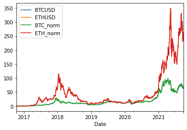
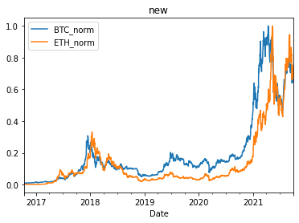
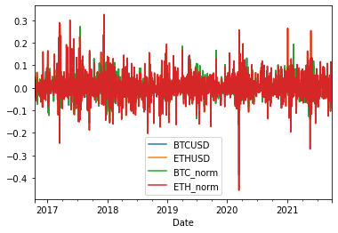

# Project_1
## Pandas & PyViz
Alex Amon

Claire Stokes

Steve Olsen

Sylvia Fan

### Bitcoin and Ethereum correlation 

### Is there an actual correlation between BTC and ETH? 

Our group looked to see if there is a correlation between Bitcoin(BTC/USD) and Ethereum (ETH/USD). 

Our groups data has shown a close correlation between BTC and ETH. One that the data points to have started in late 2017.

<font color='red'>Etherium</font>

<font color='blue'>BTC</font>

 

```python
merged_BTCETH["ETH_norm"]=merged_BTCETH["ETHUSD"] / merged_BTCETH["ETHUSD"].abs().max()
```

| Date       | BTCUSD | ETHUSD | BTC_norm | ETH_norm |
|------------|--------|--------|----------|----------|
| 2016-10-14 | 638.03 | 11.92  | 0.010034 | 0.002852 |
| 2016-10-15 | 638.16 | 11.95  | 0.010036 | 0.002859 |
| 2016-10-16 | 641.92 | 11.95  | 0.010095 | 0.002859 |
| 2016-10-17 | 639.56 | 11.96  | 0.010058 | 0.002861 |
| 2016-10-18 | 635.11 | 12.54  | 0.009988 | 0.003000 |

### Can I diversify between just these two cryptocurrencies? 

All investors should note that our data shows that trying to diversify your crypto investments between just these two cryptocurrencies, BTC and ETH, would not be a wise decision. 



```python
btceth_returns = merged_BTCETH.pct_change()
btceth_returns.head()
```

| Date       | BTCUSD    | ETHUSD   | BTC_norm  | ETH_norm |
|------------|-----------|----------|-----------|----------|
| 2016-10-14 | NaN       | NaN      | NaN       | NaN      |
| 2016-10-15 | 0.000204  | 0.002517 | 0.000204  | 0.002517 |
| 2016-10-16 | 0.005892  | 0.000000 | 0.005892  | 0.000000 |
| 2016-10-17 | -0.003676 | 0.000837 | -0.003676 | 0.000837 |
| 2016-10-18 | -0.006958 | 0.048495 | -0.006958 | 0.048495 |


### Are investors picking BTC over ETH? 

The data would suggest a similar confidence in both BTC and ETH for crypto investors. 

Ethereum seems to have the same investor confidence level as Bitcoin but with a far easier and appealing entry point for most private investors. 

### How does scarcity impact the correlation?

With Bitcoin(BTC), there will only be 21 million coins produced, of which about 18.7 million already exist. By contrast, there is no limit to the total number of Ethereum(ETH)coins that can be created, but only 18 million ether can be created in any 12-month period.

The scarcity of BTC is a driving force in its price and popularity among some investors ,while the popularity of cryptocurrencies as an investment tool overall is leading most other private and public investors into ETH and other types of crypto. 



I believe with our data visualizations , we have shown a definitive link between BTC and ETH since late 2017. 


## Now a look into the future! 

### Additional data of Ethereum and its future correlation with Bitcoin. 

Ethereum network’s transition from proof-of-work to proof-of-stake — known as Ethereum 2.0 — might limit its future correlation with Bitcoin.

One of the principal features included in the upcoming Ethereum blockchain upgrade, called Ethereum Improvement Proposal 1559, is deflation and intends to burn a portion of transaction fees collected from users.

This could in turn break the correlation of  the two cryptocurrencies in the future but that future is still uncertain.

Ethereum 2 ..... Phase 0, the beacon chain, was released on 1 December 2020. Phases 1 and 1.5 are expected in 2022

## Sources

1. [Google finance](https://docs.google.com) for price data.

2. [Bitcoin Suisse](https://www.bitcoinsuisse.com/eth-2-faq) for ETH 2. 

